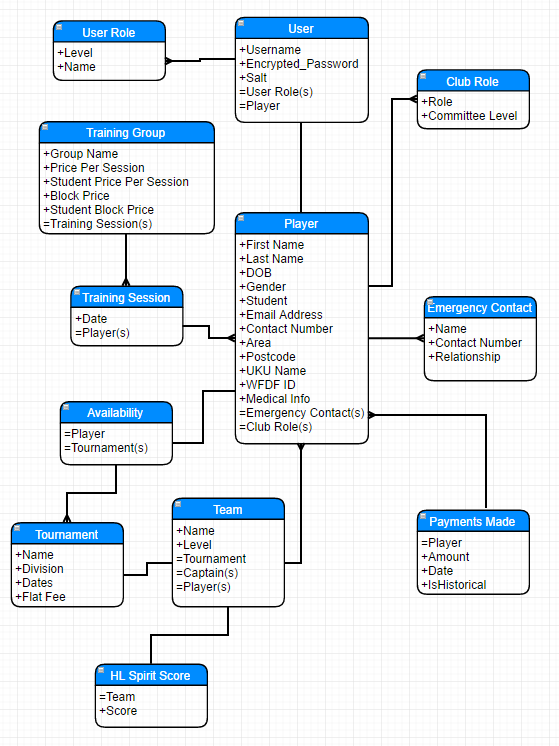

[](https://travis-ci.org/Mayjest/RUMembership)

# RUMembership
A membership and payments database app custom written for Reading ultimate, mainly for me to learn Node.

Very much a work in progress - even 'done' things are liable to change if I learn a new trick or find a new package to do it better.

# How to install
Make sure you have Node.js installed.

All steps should be using a command line (cmd in Windows, for example)
```cmd
git clone https://github.com/Mayjest/RUMembership.git

cd RUMembership

npm install
```
You might also need to install angular-cli globally.
```npm
npm install -g angular-cli
```
# Start the system

You can start both client and server with one command:

```npm
npm start
```
However, this isn't that useful for development. Ideally you'd had the client and server rebuild if you make a change so you can see 
the effect of the change quickly. Until it's working in one line, it's best to have two cmd/bash windows open and start the 
client and server separately: 

```npm
npm run _server:run
```
and
```npm
npm run _client:run
```

# Deployment
A live version is hosted on Heroku here:
[RUMembership on Heroku](https://ru-membership.herokuapp.com)

This is deployed automatically from successful commits to the RUMembership master branch on GitHub. Successful is currently defined as 'it builds and the (server) tests pass'

Feel free to create your own Heroku account and deploy what you want. You'll need to attach a PostgreSQL database to it. See the Heroku user guides for how to do all this.

# Background
The current RU membership and finance system uses a linked set of Google Sheets and Forms on Google Drive. It's a big improvement over what we had before that doesn't allow for as many risks as the previous finance/attendance sheet did, but is unfortunately fairly complicated and slow to update changes. It means that the rest of the committee has a much easier job doing the day to day management of attendance, tournament sign ups and the club finances, but it does mean I have to maintain it and add new 'features' when needed. Mainly cause I'm the only one who was willing to try writing it all and now I'm the only one who knows how it all works.

I figured if I was spending that much time on it I'd get something out of it myself as well, and I've been meaning to learn Node/Javascript for forever anyway - I'm a Java developer by trade. 

# Architecture
The server is a NodeJS app using ExpressJS to handle basically everything. It uses a PostgreSQL database for persistence, with Sequelize as the ORM between Postgres and the app. The data model is all defined /server/models, and an early version is below, though it's undergone some changes since then (mainly due to the way Sequelize defines/creates join tables):

 

 The client is written in Angular2. Current plans are to use [Angular2/Material](https://material.angular.io/) and [Google's Material Design Principles](https://material.io/guidelines/) to make everything look pretty and work on both desktop and mobile/tablet.

# Todos
- Overall client design for a consistent look and feel (navigation, colours, global css, etc)
- Client side tests and incorporate into TravisCI
- Authentication - user/player and admin for now (many roles required in future!) - possibly using oAuth
- Player Creation/update to start - both user and admin routes. User can create/control one player (themselves), and only edit some bits. Admin can edit all players but only some bits. GlobalAdmin can edit all bits of all players.
- Write up an explanation of the envisioned roles, both user (control over something in app) and club.
- Create a financial aspect - track payments made per player, so player levels of debt, both individually on log in, and a 'list of shame' available without authentication.
- Admin contact lists - be able to email players based on different criteria (gender, area, age, level of debt, etc).
- Create training attendance tracking.
    - Provide forms to let committee roles create training dates, training blocks and define cost per session, and cost per block, etc.
    - Forms to let committee roles say players attendend particular trainings
    - Automatically add a block booking/individuall trainings to player debt  
- Create tournament tracking
    - Form for committee to create tournament instances, with division/dates/cost, etc
    - Allow players to express interestand availability for tournaments
    - Allow captains (defined by role) to select teams based on availability.
    - Allow captains to alter player availability (people are terrible at signing up but will send a FB message saying they can play)
    - Allow captains/committee to track who used provided accommodation
    - Automatically add a tournament and accommodation to player debt
- Create spirit tracking
    - Add scores to teams at tournaments. Potentially provide a csv upload so we can take it straight from UKU's results
    - Individual spirit reports! Do teams do better or worse when you play for them?
- Pay debt online. Integrate Stripe (or something else, research what!) so players can pay any debt right away, withouth having to do a bank transfer.
